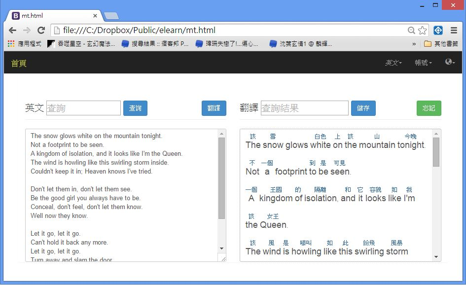
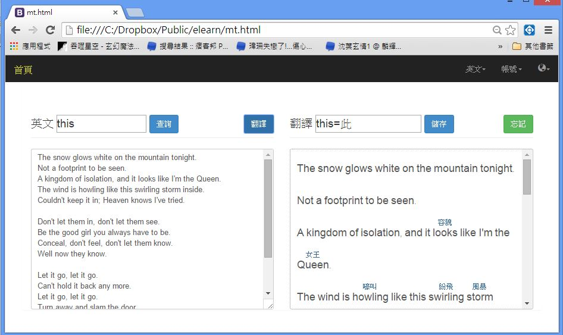

## Web 可離線應用 1 -- 逐字英翻中系統

為了要說明如何用 HTML5/CSS/JavaScript 建構出可單頁獨立運作，又可透過 localstorage 記住使用者資訊的網頁應用，我們建立了一個「逐字英翻中系統」，讓使用者可以透過 localstorage 儲存使用者紀錄的一些資訊。

首先我們在 spa.js (Single Page Application 的簡寫) 當中創建了一個稱為 DB 的物件，該物件可以用來協助「載入或儲存」資訊到 localstorage 當中，如此就可以用 load(), save() 函數記住這些資訊，必須注意的是 localstorage 當中只能儲存字串資訊，因此我們必須用 JSON.stringify() 等函數將 JSON 物件轉換成字串後才能儲存，而在取出後再用 JSON.parse() 將字串轉回 JSON 物件。


檔案: spa.js

```javascript
...
var DB = {};

DB.forget = function DB_forget(name) {
  window.localStorage.removeItem(name);
}

DB.load = function DB_load(name) {
   if (window.localStorage[name] !== undefined) 
     return JSON.parse(window.localStorage[name]);
   else
     return undefined;
}

DB.save = function DB_save(name, obj) {
  window.localStorage[name] = JSON.stringify(obj);
}
...
```

然後、我們撰寫了 mt.html 這個網頁程式，以下是該網頁的一個執行畫面：



該網頁的完整原始碼如下所示：

檔案：mt.html

```html
<!-- firefox 似乎不支援 ruby tag : http://www.w3schools.com/tags/tag_ruby.asp -->
<html>
<head>
<meta charset="utf-8" />
  <link rel="icon" href="favicon.ico">
  <link href="css/bootstrap.min.css" rel="stylesheet">
  <link href="elearn.css" rel="stylesheet">
</head>
<body onload="load()">
    <nav class="navbar navbar-inverse navbar-fixed-top" role="navigation" id="navbar">
    </nav>
    <div id="panelMT" class="container panel">
      <p class="lead">
        <form name="formMT" class="lead">
          <div class="row" style="height:300px">
            <div class="col-md-6">
              <div class="page-header">
                <span data-mt="English">原文</span>
                <input type="text" id="query" equired autofocus data-mt="Query" placeholder="" size="12"/> 
                <button class="btn btn-primary" type="button" data-mt="Query">查詢</button>
                <button class="btn btn-primary" type="button" data-mt="Translation" onclick="doMT()"  style="float:right">翻譯</button>
              </div>
              <textarea id="ebox" class="form-control" style="height:100%">
The snow glows white on the mountain tonight.
Not a footprint to be seen.
A kingdom of isolation, and it looks like I'm the Queen.
The wind is howling like this swirling storm inside.
Couldn't keep it in; Heaven knows I've tried.

Don't let them in, don't let them see.
Be the good girl you always have to be.
Conceal, don't feel, don't let them know.
Well now they know.

Let it go, let it go.
Can't hold it back any more.
Let it go, let it go.
Turn away and slam the door.
I don't care.
What they're going to say.
Let the storm rage on, the cold never bothered me anyway.
	      </textarea>
            </div>
            <div class="col-md-6">
              <div class="page-header">
                <span data-mt="Translation"></span>
                <input type="text" id="queryResult" equired autofocus data-mt="queryResult" placeholder="" size="15"/>
                <button class="btn btn-primary" type="button" data-mt="Save">儲存</button>
                <button class="btn btn-success" type="button" data-mt="Forget" onclick="forget()" style="float:right">忘記</button>
              </div>
              <div id="cbox" style="width:100%; height:100%; border:1px dotted #888; overflow:auto;" class="form-control"></div>
            </div>
            <div></div>
          </div> <!-- row -->
        </form>
      </p>
    </div>
<script>
var ebox, cbox, dict;

function load() {
  ebox = document.getElementById("ebox");
  cbox = document.getElementById("cbox");
  dict = e2cTV;
  var dbKnowWords = DB.load('knowWords');
  if (dbKnowWords === undefined)
    knowWords = {};
  else
    knowWords = dbKnowWords;
}

function forget() {
  DB.forget('knowWords');
  knowWords = {};
}

function normalize(e) {
  return e.replace("'", '_').toLowerCase();
}

function mt(str) {
  var re = /([\w']+)/gi;  
  var toStr = "";
  var si = 0;
  while (m = re.exec(str)) {
    var eword = m[1], elower=eword.toLowerCase();
    var cword = dict[eword.toLowerCase()];
    toStr += str.substring(si, re.lastIndex-eword.length);
    if (cword === undefined || knowWords[elower] !== undefined)
      cword = "";
    toStr += '<ruby class="'+normalize(eword)+'"><rb>'+eword+'</rb><rt>'+cword+'</rt></ruby>';
    si = re.lastIndex;
  }
  return toStr;
}

function doMT() {
  var cstr = mt(ebox.value);
  cbox.innerHTML = cstr.replace(/\n/g, "<BR/>");
  $('ruby').click(function() {
    var e = $(this).find('rb').text().toLowerCase();
    var c = $(this).find('rt').text();
    knowWords[e] = c;
    $('#query').val(e);
    $('#queryResult').val(e+'='+c);
    $('.'+normalize(e)).find('rt').hide();
  });
}

window.onbeforeunload = function(){
  DB.save('knowWords', knowWords);
};
</script>
    <script src="js/jquery.min.js"></script>
    <script src="js/bootstrap.min.js"></script>
    <script src="e2c.js"></script>
    <script src="spa.js"></script>
    <script src="dict.js"></script>
    <script src="navmenu.js"></script>
</body>
</html>
```

在上述程式中，我們透過攔截 window.onbeforeunload 事件，在離開網頁之前儲存想記憶的物件。

```javascript
window.onbeforeunload = function(){
  DB.save('knowWords', knowWords);
};
```

然後在網頁載入時，我們會檢查是否有已經記住的物件，若有則將之載入恢復，這樣就可以透過 localstorage 在網頁中記住較大量的資訊 (記憶量大小各家瀏覽器不同，但大致都在 5MB 以上)，這比傳統的 cookie 大多了，而且 localstorage 不會像 cookie 那樣每次都被放在表頭裡傳回伺服器，因此很適合用來於瀏覽器當中儲存較大量的資訊。

```javascript
function load() {
...
  var dbKnowWords = DB.load('knowWords');
  if (dbKnowWords === undefined)
    knowWords = {};
  else
    knowWords = dbKnowWords;
}
```

那麼、我們到底用 knowWords 物件來記住甚麼資訊呢？ 關於這點，請讀者仔細觀看下列的 doMT() 程式段落，該函數是用來將 ebox 英文區塊透過 mt() 函數逐字翻譯後，用 ruby 標記顯示中英對照在 ebox 當中，於是讀者才能看到中文在上英文在下的對照翻譯。

```javascript
function mt(str) {
  var re = /([\w']+)/gi;  
  var toStr = "";
  var si = 0;
  while (m = re.exec(str)) {
    var eword = m[1], elower=eword.toLowerCase();
    var cword = dict[eword.toLowerCase()];
    toStr += str.substring(si, re.lastIndex-eword.length);
    if (cword === undefined || knowWords[elower] !== undefined) // 已經認識的字詞就不需要再翻譯了
      cword = "";
    toStr += '<ruby class="'+normalize(eword)+'"><rb>'+eword+'</rb><rt>'+cword+'</rt></ruby>';
    si = re.lastIndex;
  }
  return toStr;
}

function doMT() {
  var cstr = mt(ebox.value);
  cbox.innerHTML = cstr.replace(/\n/g, "<BR/>");
  $('ruby').click(function() {
    var e = $(this).find('rb').text().toLowerCase();
    var c = $(this).find('rt').text();
    knowWords[e] = c;
    $('#query').val(e);
    $('#queryResult').val(e+'='+c);
    $('.'+normalize(e)).find('rt').hide(); // 將使用者點掉的字詞之翻譯隱藏起來。
  });
}
```


當使用者點選某個「中英對照」字詞的時候，代表該使用者已經認識該字詞了，所以我們會將該字詞記錄在 knowWords 這個字典物件當中，並且隱藏該字詞的翻譯，如此當使用者認識的字越來越多，被翻譯的字詞也就會越來越少，於是隨著使用者的進步就可以逐漸完全讀懂整篇原文，而不需要依賴系統的翻譯功能了 (這也是本系統與一般翻譯系統最大的不同點，本系統是幫助學習英文，而不是企圖做出一個很厲害的機器翻譯系統)。



上述程式裡的幾個關鍵部分，我們已經用了中文註解進行說明，讀者應該很容易可以看出這幾個關鍵程式碼的功能才對！

透過這種方式，我們可以讓網頁變成一種類似 APP 的應用，而且不需要伺服端的配合。

(當然、如果加上伺服端之後，還可以將這些 localstorage 中的資訊傳回到伺服器永久記住，這樣即使換了一台電腦，也不會忘記這些資訊了)。


